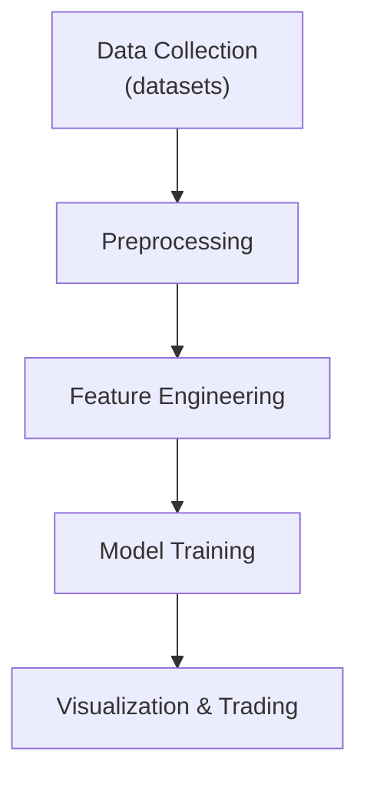

# CAP Predictor

## Project Goals
- Aggregate market and news data for selected tickers
- Derive sentiment-driven features
- Train time-series models to forecast stock movements
- Provide utilities for visualization and trading experiments

## Architecture


## Workflow
1. **Create environment file**
   ```bash
   cp .env.example .env
   ```
   Fill in API keys and adjust paths or hyperparameters as needed.
2. **Install dependencies**
   ```bash
   pip install -e .[dev]
   ```
3. **Collect data**
   ```bash
   python -m sentimental_cap_predictor.dataset TICKER --period 1Y
   ```
   The `period` can be passed with `--period` (shown above) or as a positional
   argument for backward compatibility and defaults to `max` if omitted.
4. **Generate plots**
   ```bash
   python -m sentimental_cap_predictor.plots TICKER
   ```
5. **Run sentiment analysis model**
   ```bash
   python -m sentimental_cap_predictor.modeling.sentiment_analysis <NEWS_PATH>
   ```

## Typer CLI Usage
Each module exposes a Typer application:
- `sentimental_cap_predictor.dataset` – download price and news data
- `sentimental_cap_predictor.plots` – visualize processed data
- `sentimental_cap_predictor.modeling.sentiment_analysis` – train and evaluate sentiment models
- `sentimental_cap_predictor.llm_core.chatbot` – chat with a local Mistral-powered assistant that consults main and experimental models and explains its decisions

Run `--help` with any module for detailed options.

## Qwen Frontend and `CMD:` Protocol

The project includes a lightweight frontend that chats with a **local** Qwen
model and supports a simple command protocol. Download a Qwen checkpoint from
Hugging Face and set `QWEN_MODEL_PATH` to its directory (defaults to
`Qwen/Qwen2-1.5B-Instruct`). If the model does not fit entirely in GPU or CPU
memory, set `QWEN_OFFLOAD_FOLDER` to a directory where the remaining weights can
be offloaded. For convenience, alias the module and then run the chatbot:

```bash
alias capbot="python -m sentimental_cap_predictor.llm_core.chatbot"
python -m sentimental_cap_predictor.llm_core.chatbot
```

Responses that begin with `CMD:` request that your environment execute the
following shell command. Use an external runner that detects this prefix,
runs the command, and feeds its output back to the chat session.

## Documentation

See the [User Manual](docs/user_manual.md) for environment setup, workflow
descriptions, and testing guidance. For topic-specific guides, browse the
[Documentation Index](docs/index.md).

## Offline Testing

Some tests require downloading market data. To run them without making
network calls, set `OFFLINE_TEST=1`. When this flag is enabled the suite reads
prices from `tests/data/<TICKER>_prices.csv` instead of contacting external
APIs. Select which ticker to use via the `TEST_TICKER` environment variable
(defaults to `AAPL`).

Example:

```bash
OFFLINE_TEST=1 TEST_TICKER=AAPL pytest tests/test_plots_e2e.py
```
