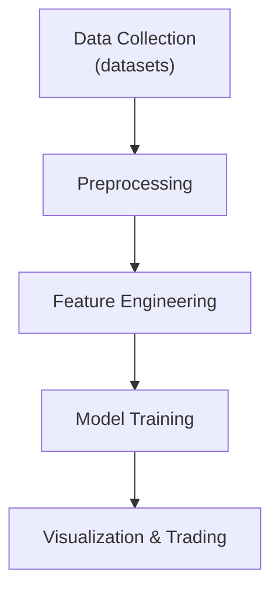

# CAP Predictor

## Project Goals
- Aggregate market and news data for selected tickers
- Derive sentiment-driven features
- Train time-series models to forecast stock movements
- Provide utilities for visualization and trading experiments

## Architecture


## Workflow
1. **Create environment file**
   ```bash
   cp .env.example .env
   ```
   Fill in API keys and adjust paths or hyperparameters as needed.
2. **Install dependencies**
   ```bash
   pip install -e .[dev]
   ```
3. **Collect data**
   ```bash
   python -m sentimental_cap_predictor.dataset TICKER --period 1Y
   ```
4. **Generate plots**
   ```bash
   python -m sentimental_cap_predictor.plots TICKER
   ```
5. **Run sentiment analysis model**
   ```bash
   python -m sentimental_cap_predictor.modeling.sentiment_analysis <NEWS_PATH>
   ```

## Typer CLI Usage
Each module exposes a Typer application:
- `sentimental_cap_predictor.dataset` – download price and news data
- `sentimental_cap_predictor.plots` – visualize processed data
- `sentimental_cap_predictor.modeling.sentiment_analysis` – train and evaluate sentiment models

Run `--help` with any module for detailed options.

## Testing

1. **Install development dependencies**
   ```bash
   pip install -e .[dev]
   ```
2. **Run linters and formatters**
   ```bash
   pre-commit run --all-files
   ```
3. **Execute tests**
   ```bash
   pytest
   ```
   `make test` is also supported.

Environment variables such as `TEST_TICKER` (to choose a ticker for integration
tests) and `OFFLINE_TEST` (to disable external data fetching) may be required for
certain test scenarios.
