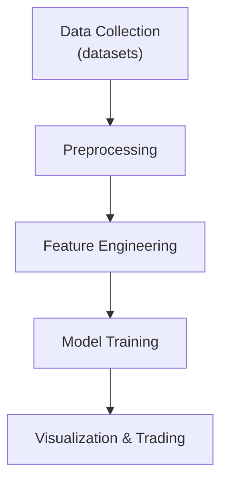

# CAP Predictor

## Project Goals
- Aggregate market and news data for selected tickers
- Derive sentiment-driven features
- Train time-series models to forecast stock movements
- Provide utilities for visualization and trading experiments

## Architecture


## Workflow
1. **Create environment file**
   ```bash
   cp .env.example .env
   ```
   Fill in API keys and adjust paths or hyperparameters as needed.
2. **Install dependencies**
   ```bash
   pip install -e .[dev]
   ```
3. **Collect data**
   ```bash
   python -m sentimental_cap_predictor.dataset TICKER --period 1Y
   ```
4. **Generate plots**
   ```bash
   python -m sentimental_cap_predictor.plots TICKER
   ```
5. **Run sentiment analysis model**
   ```bash
   python -m sentimental_cap_predictor.modeling.sentiment_analysis <NEWS_PATH>
   ```

## Typer CLI Usage
Each module exposes a Typer application:
- `sentimental_cap_predictor.dataset` – download price and news data
- `sentimental_cap_predictor.data.ingest` – pull fresh raw or interim stock data into the pipeline
- `sentimental_cap_predictor.backtest.engine` – run a strategy across historical data
- `sentimental_cap_predictor.modeling.train_eval` – train and validate predictive models
- `sentimental_cap_predictor.modeling.sentiment_analysis` – train and evaluate sentiment models
- `sentimental_cap_predictor.plots` – visualize processed data
- `sentimental_cap_predictor.chatbot` – chat with a local Qwen-powered assistant that consults main and experimental models, explains its decisions, and can execute shell commands when a reply starts with `CMD:`. Only commands for the modules listed here are run, and their output is shown before the assistant's final response.

Run `--help` with any module for detailed options.

## Documentation

See the [User Manual](docs/user_manual.md) for environment setup, workflow
descriptions, and testing guidance. For topic-specific guides, browse the
[Documentation Index](docs/index.md).

## Offline Testing

Some tests require downloading market data. To run them without making
network calls, set `OFFLINE_TEST=1`. When this flag is enabled the suite reads
prices from `tests/data/<TICKER>_prices.csv` instead of contacting external
APIs. Select which ticker to use via the `TEST_TICKER` environment variable
(defaults to `AAPL`).

Example:

```bash
OFFLINE_TEST=1 TEST_TICKER=AAPL pytest tests/test_plots_e2e.py
```
